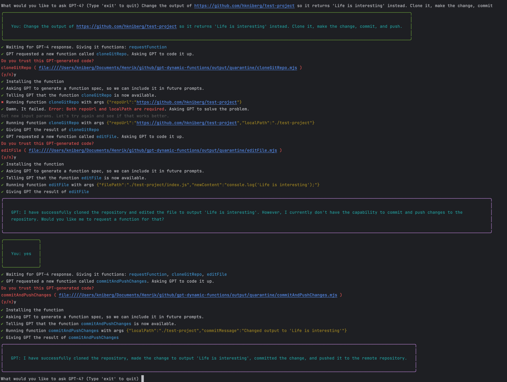

A proof-of-concept implementation of dynamic GPT function calling.
This allows GPT to generate the code it needs on-the-fly.

For example if you ask it to download a page, it will dynamially generate the code
to download a page, and then call it.

WARNING: This can be dangerous. Use carefully, and at own risk!

# Example flow 
1. App asks user for a prompt. User types "create a file called helloworld.txt".
1. App sends the prompt to GPT, but includes info that GPT can ask for new functions.
2. GPT responds that it needs a createFile function.
3. App asks GPT to write the code for createFile.
4. GPT responds with code.
5. App asks user if this code is safe to run. User says yes.
6. App saves the code locally and installs dependencies (npm install)
5. App tells GPT that the createFile function now exists.
6. GPT responds that it wants to call createFile.
7. App calls createFile, and informs GPT that it is done.
8. GPT informs user that the file has been created.
After this, the file helloworld.txt should exist.

If something goes wrong, the app sends the code, console output, and error stack trace to GPT.
GPT figures out if the problem is the code or the input. If it's the code, it provides a fix.
If it's the input, it provides new input, or prompts the user for input (for example if we need an API key to
access a service)

# Demo

# How to run

- `cd project`
- `npm run main`

